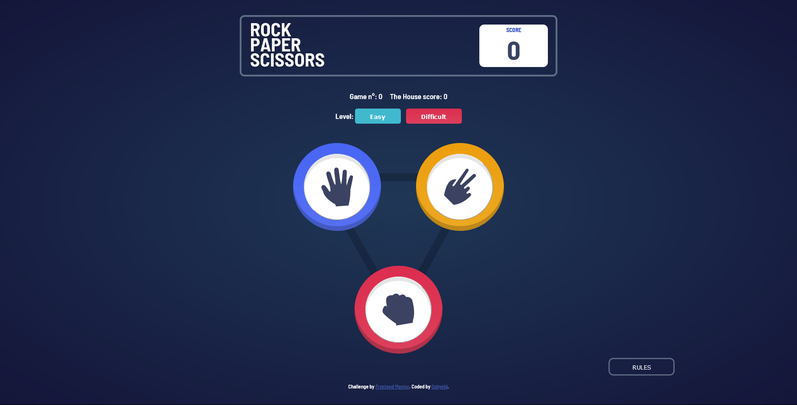
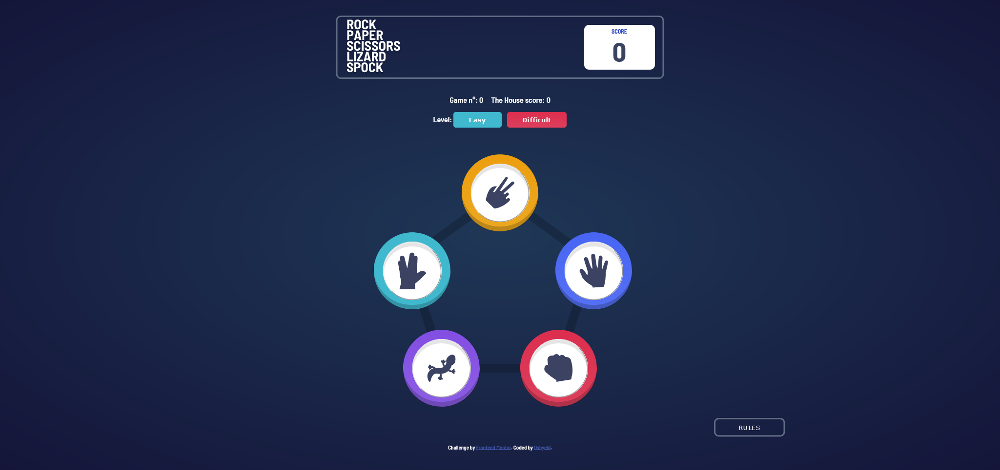

# Frontend Mentor - Rock, Paper, Scissors solution

This is a solution to the [Rock, Paper, Scissors challenge on Frontend Mentor](https://www.frontendmentor.io/challenges/rock-paper-scissors-game-pTgwgvgH). Frontend Mentor challenges help you improve your coding skills by building realistic projects.

[Here is the link to the game](https://dinadess.github.io/rock-paper-scissors-fm/)

## Table of contents

- [Overview](#overview)
  - [The challenge](#the-challenge)
  - [Rules](#rules)
  - [Original](#original)
  - [Bonus](#bonus)
  - [Screenshot](#screenshot)
  - [Links](#links)
- [My process](#my-process)
  - [Built with](#built-with)
  - [What I learned](#what-i-learned)
  - [Continued development](#continued-development)
  - [Useful resources](#useful-resources)
- [Author](#author)

## Overview

### The challenge

Users should be able to:

- View the optimal layout for the game depending on their device's screen size
- Play Rock, Paper, Scissors against the computer
- Maintain the state of the score after refreshing the browser _(optional)_
- **Bonus**: Play Rock, Paper, Scissors, Lizard, Spock against the computer _(optional)_

### Rules

If the player wins, they gain 1 point. If the computer wins, the player loses one point.

#### Original

- Paper beats Rock
- Rock beats Scissors
- Scissors beats Paper

#### Bonus

- Scissors beats Paper
- Paper beats Rock
- Rock beats Lizard
- Lizard beats Spock
- Spock beats Scissors
- Scissors beats Lizard
- Paper beats Spock
- Rock beats Scissors
- Lizard beats Paper
- Spock beats Rock

Not sure what Rock, Paper, Scissors, Lizard, Spock is? [Check out this clip from The Big Bang Theory](https://www.youtube.com/watch?v=iSHPVCBsnLw).

### Screenshot

Below are Screenshots of the first steps of the game




### Links

- Solution URL: [My solution on Frontend Mentor](https://www.frontendmentor.io/solutions/responsive-rock-paper-scissors-css-flexbox-vanilla-js-7UV0WQm62)
- Live Site URL: [Check out the live URL here](https://dinadess.github.io/rock-paper-scissors-fm/)

## My process

### Built with

- Semantic HTML5 markup
- CSS custom properties
- Flexbox
- Mobile-first workflow
- Vanilla JS

### What I learned

I had the opportunity to practice the JS language I'm currently learning:

- to think of the problems before starting coding, to have a global view of the variables I'll need (Actually,
  I didn't do this the first time 😅, I had to delete almost all the code I wrote and rewrite it all)
- refactor code into functions according to the DRY principle
- debug as some things didn't work out properly, I use loads of (console.log()) to figure them out.

Here are some code lines I'm proud of:

```css
.icon::after {
  content: "";
  display: inline-block;
  width: 135%;
  height: 135%;
  border-radius: 50%;
  position: absolute;
  z-index: -1;
  box-shadow: inset 0px -10px rgba(0, 0, 0, 0.2);
}
```

I'm quite proud of this one as I didn't know how to create the colored circles around the icons and make
them look like coins with the inner shadow.
After some mistakes, I got this solution...

```js
console.log(
  `I am proud of every single line of js code I wrote cause at the beginning I thought it would be a very big challenge but finally I nailed it!`
);
```

### Continued development

I will keep learning js to improve my coding style and write more DRY code.

### Useful resources

- [The Complete JavaScript Course 2022: From Zero to Expert! by Jonas Schmedtmann](https://www.udemy.com/course/the-complete-javascript-course/) - This is the JS course I'm currently learning, it helped me a lot to understand how JS works and to be solution-oriented.

## Author

- Frontend Mentor - [@dinadess](https://www.frontendmentor.io/profile/dinadess)
